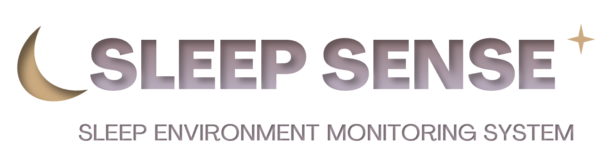
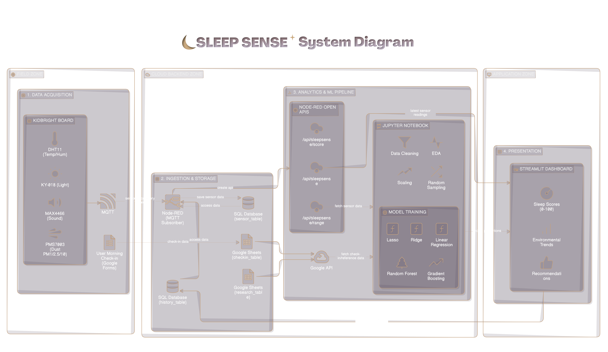
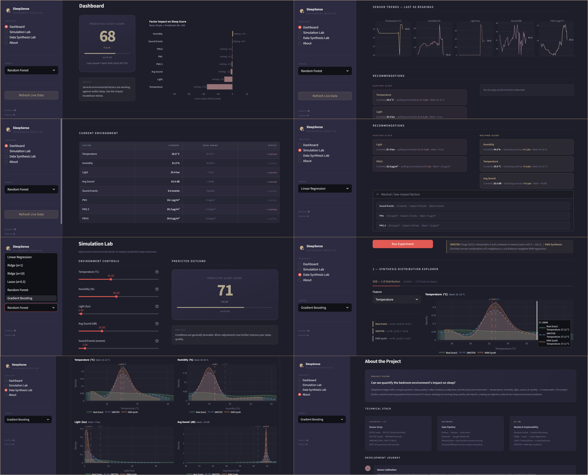

# SleepSense: Sleep Environment Monitoring System

**SleepSense** is an integrated IoT and Machine Learning system designed to monitor bedroom environmental factors and analyze their impact on sleep quality. By combining real-time sensor data with user-reported sleep scores, the system provides a data-driven "Environment Score" (0-100) and actionable recommendations to optimize your sleep space.

-----

## Overview & Significance

Sleep quality is often dictated by invisible environmental factors. SleepSense bridges the gap between hardware monitoring and health data science by:

  * **Monitoring** critical factors like temperature, air quality, and noise in real-time.
  * **Predicting** sleep suitability using a baseline model derived from secondary research.
  * **Personalizing** insights over time as the system learns the user's specific sensitivities to their environment.

-----

## System Architecture

The system follows a multi-zone architecture from data acquisition to presentation.



### 1\. Field Zone (Data Acquisition)

We utilize a **KidBright** board to collect data from four primary sensors, calibrated to standard units:

  * **DHT11:** Temperature (°C - `temp_c`) and Relative Humidity (% - `hum_pct`).
  * **KY-018:** Light Intensity (lux - `light_lux`).
  * **MAX4466:** Sound Intensity (dB - `snd_avg`) and Noise Events (Times - `snd_evt`).
  * **PMS7003:** Particulate Matter (µg/m³ - `pm1`, `pm25`, `pm10`).

### 2\. Cloud Backend & Ingestion

  * **Communication:** Data is transmitted via **MQTT**.
  * **Backend:** **Node-RED** acts as the central hub, subscribing to MQTT topics and storing sensor data in a SQL Database every 10 minutes calles **sensor\_table**.
  * **Check-in Data:** A Google Form "Morning Check-in" collects manual sleep scores and sleep duration windows into a **checkin\_table**.
  * **Research Data:** A **research\_table** contains secondary data (e.g., optimal temperature ranges of 18-22°C) to provide a baseline for the ML model.

### 3\. Open APIs

Three RESTful endpoints were developed via Node-RED for data accessibility:

1.  `GET /api/sleepsense/`: Fetches all sensor data and the latest reading for real-time scoring.
2.  `GET /api/sleepsense/range?start={T1}&end={T2}`: Retrieves specific time-range data for model training.
3.  `GET /api/sleepsense/score`: Stores history of calculated scores and factors for longitudinal analysis.

-----

## Analytics & Machine Learning Pipeline

The data processing is handled in a Jupyter Notebook environment:

1.  **Data Integration:** Merging `sensor_table`, `checkin_table`, and `research_table`.
2.  **Sampling:** To prevent bias, the system randomly samples **5 rows per sleep session** to ensure equal weighting across different nights.
3.  **Preprocessing:** Data cleaning (outliers/missing values), Exploratory Data Analysis (EDA), and **Scaling** for normalization.
4.  **Modeling:** We compared several regression models to predict Sleep Scores:
      * Linear Regression
      * Ridge & Lasso Regression
      * Random Forest
      * Gradient Boosting

-----

## Streamlit Dashboard

The **Streamlit** application provides a professional "Minimal & Zen" interface to:

  * Display real-time environment scores.
  * Visualize trends in PM levels, noise, and temperature.
  * Provide actionable recommendations (e.g., "Temperature is too high; consider lowering it for better sleep").



-----

## Installation & Setup

### Prerequisites

  * Python 3.9+
  * Node-RED
  * SQL Database (PostgreSQL/MySQL)
  * Google Cloud Platform (GCP) Service Account for Google Sheets API

### 1\. Clone the Repository

```bash
git clone https://github.com/your-username/sleepsense.git
cd sleepsense
```

### 2\. Backend Setup (Node-RED)

  * Import the provided flow JSON from the `/node-red` directory.
  * Configure your MQTT broker credentials.
  * Update SQL connection strings in the DB nodes.

### 3\. Analytics Setup

Install required Python libraries:

```bash
pip install -r requirements.txt
```
```bash
pip install -r requirements_app.txt
```

*Key libraries: `pandas`, `scikit-learn`, `streamlit`, `gspread`, `requests`.*

### 4\. Run the Dashboard

```bash
python -m streamlit run sleepsense_app_refined.py  
```

